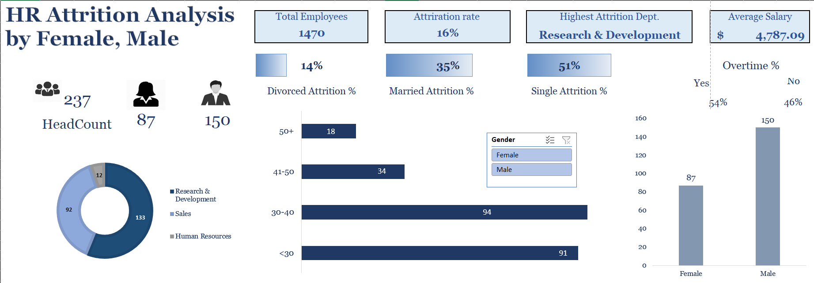
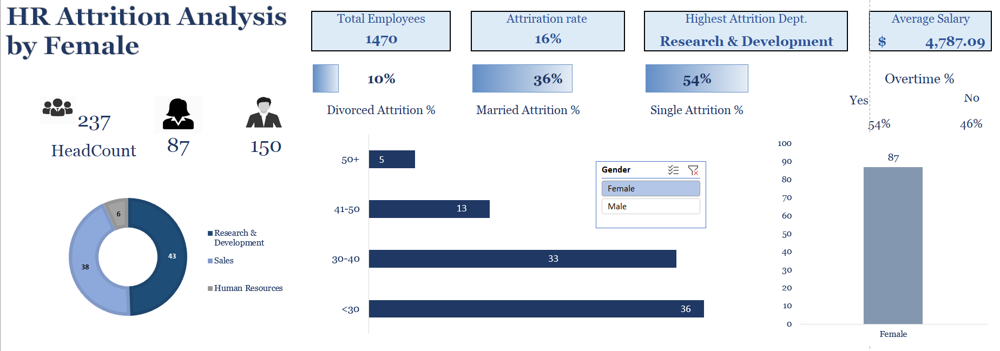
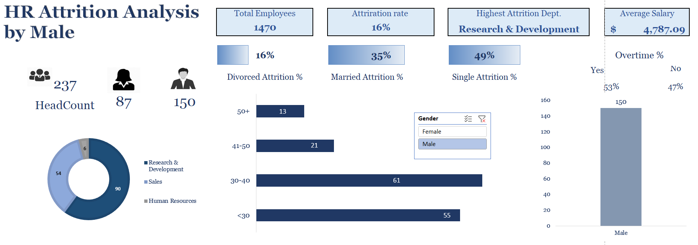

# HR Attrition Analysis Dashboard (Excel)

This project presents a HR Attrition Analysis dashboard built entirely in **Microsoft Excel** using pivot tables, graphs, slicers, and formulas.

## 📊 Project Overview

The dashboard provides HR metrics related to employee attrition segmented by gender, marital status, overtime status, age groups, and departments.

### 📌 Features
- KPIs mentioned: Total Employees, Attrition Rate, Highest Attrition Department, Average Salary
- Interactive slicer to filter by gender
- Department-wise attrition donut chart
- Age-wise attrition bar chart
- Overtime attrition comparison
- Marital Status Affecting Attrition Rate

## 🧠 Insights Gained

- **Attrition Rate**: 16% of total employees have left the company.
- **Gender-wise Attrition**: Male attrition count is higher than female.
- **Department with Highest Attrition**: Research & Development.
- **Marital Status Influence**: Single employees show higher attrition.
- **Overtime Impact**: Majority of attrition cases are linked to overtime.
- **Age Group Trend**: Employees aged 30–40 have the highest attrition rate.

## Use Cases
- HR team performance monitoring
- Internal HR analytics for strategy development
- Excel dashboarding and visualization demonstration

### Dashboard View 1

### Dashboard View 2

### Dashboard View 3

## Tools Used
- Microsoft Excel (Pivot Tables, Slicers, Formulas)
- Chart visualizations (donut, bar, column)

